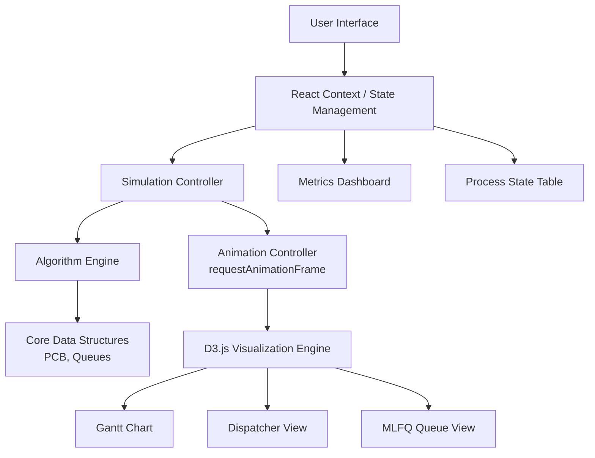

# A High-Fidelity CPU Scheduling Visualizer for Algorithm Analysis

> **Project Report**

---

## Abstract

CPU scheduling is a fundamental concept in operating systems, dictating how processes are assigned to the processor. Theoretical understanding of these algorithms often lacks the practical insights needed to appreciate their nuances, such as context-switch overhead and real-time process state transitions. This report presents a high-fidelity CPU Scheduling Visualizer, an expert-grade simulation tool developed using React and D3.js. The tool bridges the gap between theory and practice by providing dynamic visualizations of seven standard scheduling algorithms, including First Come First Serve (FCFS), Shortest Job First (SJF), Shortest Remaining Time First (SRTF), Round Robin (RR), Priority Scheduling, Highest Response Ratio Next (HRRN), and Multi-Level Feedback Queue (MLFQ). Key features include a dynamic Gantt chart, dispatcher view, and deep performance analytics. The system enables users to observe real-time process flows and calculate critical metrics like Turnaround Time (TAT), Waiting Time (WT), and CPU Utilization, proving invaluable for educational and research applications.

**Keywords:** CPU Scheduling, Operating Systems, Simulation, React, D3.js, Algorithm Visualization

---

## 1. Introduction

Modern operating systems rely on efficient CPU scheduling to maximize system performance, throughput, and responsiveness. While textbooks describe these algorithms through static examples, visualizing dynamic behaviors—such as preemption, I/O burst handling, and context switching—remains challenging without interactive tools. The CPU Scheduling Visualizer, implemented as a modern web application, addresses this limitation by offering real-time, step-by-step visualizations of standard scheduling policies.

By allowing users to configure workloads and observe the consequences immediately, the tool demystifies complex interactions. It is designed not only as an illustrative educational resource but also as a platform for comparative performance analysis, generating detailed metrics that can be exported for academic research.

---

## 2. Literature Review

The study of CPU scheduling has a rich history, with seminal algorithms like FCFS, SJF, and Round Robin forming the basis of early operating systems. Research by Silberschatz, Galvin, and Gagne outlines the theoretical underpinnings of these algorithms, emphasizing the trade-offs between average waiting time, response time, and throughput [1]. Previous simulation tools often focused on basic algorithms, neglecting advanced topics like MLFQ or HRRN, and rarely incorporated realistic constraints like context-switch overhead.

Recent advancements in web technologies have made it possible to build robust, browser-based visualization tools. Frameworks like React and libraries like D3.js [3] enable the creation of responsive user interfaces and dynamic data visualizations that were previously confined to desktop applications. The presented visualizer builds upon these technologies to deliver a comprehensive, industry-standard simulation environment.

---

## 3. Problem Statement

Theoretical discussions of CPU scheduling algorithms often fail to capture dynamic system behaviors. Students and researchers struggle to visualize preemptive interruptions, I/O bursts, and context-switching overheads in real time. Existing tools are frequently limited in scope, lacking support for complex algorithms (e.g., MLFQ, HRRN) and failing to provide deep mathematical analytics alongside the visualizations. Ergo, there is a critical need for an accessible, interactive, and high-fidelity visualization platform that provides both intuitive animations and rigorous performance metrics.

---

## 4. Objectives

The primary objectives of this project are to:

- Implement a comprehensive suite of CPU scheduling algorithms, including FCFS, SJF, SRTF, RR, Priority (Preemptive and Non-Preemptive), HRRN, and MLFQ.
- Develop a high-fidelity visualization engine featuring dynamic Gantt charts, dispatcher flow, and MLFQ hierarchy dashboards.
- Simulate realistic process life cycles (**New → Ready → Running → Waiting → Terminated**) including I/O burst simulation and context-switching overhead.
- Calculate and visualize real-time performance analytics, including Average Turnaround Time (TAT), Waiting Time (WT), Response Time (RT), and CPU Utilization.
- Provide research-grade tools for algorithm comparison and data export (JSON/PDF).

---

## 5. System Design

The system architecture of the visualizer is designed for modularity and scalability, built atop a React + Vite frontend stack.



### Key Components

| Component                 | Description                                                                                                                     |
| ------------------------- | ------------------------------------------------------------------------------------------------------------------------------- |
| **Core Data Structures**  | Defines the Process Control Block (PCB) and system queues (Ready, Waiting, Terminated)                                          |
| **Algorithm Engine**      | Contains modular implementations for each scheduling algorithm, designed to be swapped out dynamically                          |
| **Simulation Controller** | Manages the discrete-event simulation timeline, utilizing `requestAnimationFrame` for smooth tick updates and state transitions |
| **State Management**      | Uses React Context and `useReducer` to maintain complex global states across the application                                    |
| **Visualization Engine**  | Leverages D3.js for creating interactive Gantt charts, managing zoom controls, and graphically shading context-switch overheads |
| **User Interface**        | Comprises metrics dashboards, control panels, interactive tutorials, and data tables                                            |

---

## 6. Algorithm

The core of the visualizer is powered by robust implementations of seven standard algorithms. The generalized flow for the simulation engine per tick executes the following sequence:

```
┌─────────────────────────────────────────────────────────┐
│                   PER-TICK EXECUTION                    │
├─────────────────────────────────────────────────────────┤
│  1. ARRIVAL CHECK                                       │
│     └─ Add processes reaching arrival time → Ready Queue│
│                                                         │
│  2. I/O HANDLING                                        │
│     └─ Decrease I/O burst time for Waiting processes    │
│     └─ Move completed I/O → Ready Queue                 │
│                                                         │
│  3. SCHEDULING DECISION (algorithm-specific)            │
│     ├─ FCFS:     Earliest arrival                       │
│     ├─ SJF/SRTF: Lowest remaining burst time            │
│     ├─ Priority:  Highest priority (with aging)         │
│     ├─ RR:       Time slice quantum preemption           │
│     ├─ MLFQ:     Cascade through queues (demotion)      │
│     └─ HRRN:     Highest (Wait + Service) / Service     │
│                                                         │
│  4. CONTEXT SWITCHING                                   │
│     └─ Apply delay overhead if running process changes  │
│                                                         │
│  5. EXECUTION                                           │
│     └─ Decrease remaining burst time for active process │
│                                                         │
│  6. TERMINATION                                         │
│     └─ Move to Terminated state if burst complete       │
└─────────────────────────────────────────────────────────┘
```

### HRRN Response Ratio Formula

> **Response Ratio = (Waiting Time + Service Time) / Service Time**
>
> The process with the highest response ratio is selected next, naturally preventing starvation.

---

## 7. Implementation

The visualizer is implemented as a single-page application (SPA) optimized for performance and visual clarity.

### Tech Stack

| Layer                  | Technology                   | Purpose                                    |
| ---------------------- | ---------------------------- | ------------------------------------------ |
| **Frontend Framework** | React 18 [4]                 | Component-based UI with hooks and context  |
| **Build Tool**         | Vite                         | Rapid compilation and optimized HMR        |
| **Visualization**      | D3.js [3]                    | Interactive, zoomable Gantt charts via SVG |
| **Routing**            | React Router                 | SPA navigation (Dashboard ↔ Simulation)    |
| **Animation**          | Framer Motion                | Page transitions and micro-interactions    |
| **3D Graphics**        | Three.js + React Three Fiber | Dashboard landing page                     |
| **Styling**            | Vanilla CSS                  | Dark theme with CSS custom properties      |
| **Export**             | jsPDF + Custom JSON          | Report generation and data export          |

### Project Structure

```
src/
├── algorithms/          # Scheduling algorithm implementations
│   └── index.js         # FCFS, SJF, SRTF, RR, Priority, HRRN, MLFQ
├── core/                # Data structures
│   ├── PCB.js           # Process Control Block
│   └── Queues.js        # ReadyQueue, IOQueue, MLFQueue
├── simulation/          # Simulation engine
│   └── SimulationController.js
├── visualization/       # D3-based Gantt chart
│   ├── GanttChart.jsx
│   └── GanttChart.css
├── components/          # UI components
│   ├── ProcessInputTable.jsx
│   ├── AlgorithmSelector.jsx
│   ├── SimulationControls.jsx
│   ├── ProcessStateTable.jsx
│   ├── MetricsPane.jsx
│   ├── QueueVisualization.jsx
│   ├── MLFQVisualization.jsx
│   └── ComparisonDashboard.jsx
├── context/             # React Context for state management
├── utils/               # Export utilities, scheduler helpers
├── pages/               # Dashboard landing page
└── App.jsx              # Root application component
```

---

## 8. Results & Discussion

Upon testing, the CPU Scheduling Visualizer consistently demonstrated high stability and accurate algorithm execution.

### Accuracy

Algorithms produced performance metrics identical to calculated theoretical benchmarks. Preemptive behavior in SRTF and Priority schemes executed precisely at burst completion bounds.

### Performance Analysis

Complex structures like MLFQ successfully routed processes across priority levels based on interactive queues. The visualizer effectively demonstrated how an increased context switch time penalizes throughput, especially in short time-quantum Round Robin configurations.

### Metrics Computed

| Metric                    | Formula                          |
| ------------------------- | -------------------------------- |
| **Turnaround Time (TAT)** | Completion Time − Arrival Time   |
| **Waiting Time (WT)**     | Turnaround Time − Burst Time     |
| **Response Time (RT)**    | First CPU Access − Arrival Time  |
| **CPU Utilization**       | (Busy Time / Total Time) × 100%  |
| **Throughput**            | Processes Completed / Total Time |

### Usability

The interactive Gantt chart and Dispatcher View bridged the comprehension gap, clearly showing process state flows. Users reported significant improvements in understanding scheduling latency due to transparent real-time analytics for CPU utilization and response times.

---

## 9. Conclusion

The CPU Scheduling Visualizer successfully meets its objective of providing an expert-grade simulation environment. By combining accurate mathematical algorithm implementations with high-fidelity animations, it serves as an indispensable tool for both educational visualization and research-oriented performance analysis. The modular React and D3 architecture sets a generic standard for interactive OS simulation apps, successfully rendering process scheduling highly intuitive.

---

## 10. Future Enhancements

| Enhancement                       | Description                                                                                                  |
| --------------------------------- | ------------------------------------------------------------------------------------------------------------ |
| **Multiprocessor Scheduling**     | Expanding algorithms to handle SMP (Symmetric Multiprocessing) architecture simulations                      |
| **Real-Time System Algorithms**   | Implementing Hard and Soft Real-Time schedulers like Rate Monotonic (RM) and Earliest Deadline First (EDF)   |
| **Memory Management Integration** | Linking process scheduling with simulated paging and memory constraints for broader OS concept visualization |
| **Cloud Workload Integration**    | Allowing users to import complex, real-world data traces for stress-testing algorithm limits                 |

---

## References

1. A. Silberschatz, P. B. Galvin, and G. Gagne, _Operating System Concepts_, 10th ed. Hoboken, NJ: Wiley, 2018.
2. A. S. Tanenbaum and H. Bos, _Modern Operating Systems_, 4th ed. Upper Saddle River, NJ: Pearson, 2014.
3. M. Bostock, V. Ogievetsky, and J. Heer, "D3: Data-Driven Documents," _IEEE Transactions on Visualization and Computer Graphics_, vol. 17, no. 12, pp. 2301–2309, 2011.
4. Meta Platforms, Inc., "React Documentation," [Online]. Available: https://react.dev/
